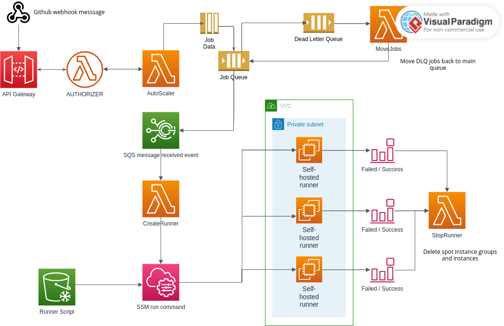
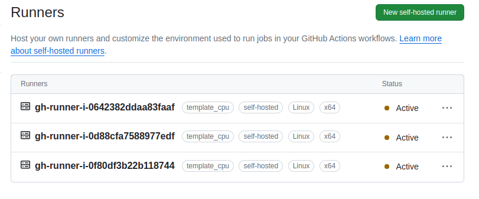

### AWS Self-hosted runner 

Framework for creating self-hosted runners in Github that run on AWS.

It uses:

* Terraform - 1.8.1
* AWS boto3 - 1.34.80
* Python lambdas - python 3.10.8 
* Custom bash scripts


### Design



* Firstly, create a Github PAT ( Personal Access Token ) with the following permissions:

```
Token (Classic)

Scopes:

workflow

admin:org
  read:org
  write:org
  manage_runners:org
```

Note the value of the token as we need it in next stage.


* Create a secrets.tfvars file with the following values:
  ```
  gh_token = "XXX" ( set to the PAT token )
  gh_webhook_secret = "XXX" ( set to a password )
  ```


* Create the infrastructure using the above secrets file:
    ```
    terraform -chdir=terraform_files init 

    terraform -chdir=terraform_files plan -out=tfplan -vars-file secrets.tfvars

    terraform -chdir=terraform_files apply
    ```

* The output will return the URL for API Gateway. Under the Repository > Settings, create a new Webhook:
  ```
  Add the apigateway url as <API GATEWAY URL>/webhook

  Set the password to be the same as gh_webhook_secret
  
  Set the Content-Type to application/json
  
  Enable ssl verification
  
  Select the following events: Workflow jobs, workflow runs
  ```
  
  Since only the workflow jobs and runs events are parsed, we only need the two else the lambda will have many events to process which may cause it to slow down...


* Under the webhook tab Deliveries, check for the status of a Ping message. If it returns 200, it's successful. If not refer to the errors in the Cloudwatch Logs.


* Check that the runners are created under Settings > Actions > Runners
  
  

* To use the runners, update the github workflow labels to match the template names created via terraform above

  For example, if the template name is **template_cpu**, the labels must be specified in the workflow as such:

  ```
  ...

  jobs:
  main:
    runs-on: [self-hosted, template_cpu]

  ...
  
  ```

### How it works

The webhook request goes to the APIGateway which posts the job data to the **Autoscaler** lambda. It checks that the request is from Github. It creates a SQS message with the job data as its body.

After the job is added to **SQS** queue, it triggers an event rule which invokes a lambda **CreateRunner** that fetches the SQS message and creates a EC2 Spot request using the launch template created earlier. 

If an error occurs, which it will due to the service quota permitted on your account, the message will be hidden back in SQS queue for 15 minutes to be visible again. If the same message fails more than 3 times, it will be moved to a dead letter queue, and retry in an hours time via an event schedule which invokes **MoveJobs** lambda to move the messages back to the main queue.

Once the instance is available, it invokes **SSM RunCommand** to fetch the runner script from S3 and run it remotely on the instance. 

If it's successful, the runners are created and the SSM command waits till the runner exits. If unsuccessful, it triggers an event that invokes **StopRunner** which removes the EC2 Instance and spot requests. This lambda is also called when the runner terminates after successful job completion, which removes the spot request and instance.


### How is this different from other frameworks?

[generate-jitconfig]: https://docs.github.com/en/rest/actions/self-hosted-runners?apiVersion=2022-11-28#create-configuration-for-a-just-in-time-runner-for-a-repository

After experimenting with other frameworks, the conclusion is that its complicated due to:

* Use of multiple lambdas that are difficult to synchronize due to timing issues
* Long running runners that run as a service
* Lambda code not in python


The approach here is simple:

* Create just-in-time runners when required
* Delete the runners when the job is completed
* Make use of Spot Instances to save costs

The github self-hosted runner allows one to create a JIT runner via the Github Api endpoint [generate-jitconfig]

It creates an encrypted token which is passed to the runner's ./run.sh script which automatically deletes and deregisters the runner once the work completes.

In addition, since the runner script is invoked via SSM RunCommand, the script exit triggers the event rule which invokes a lambda to delete the ec2 instance and its spot request.

In this way, its creating runners dynamically if and when a job is present on the SQS queue.